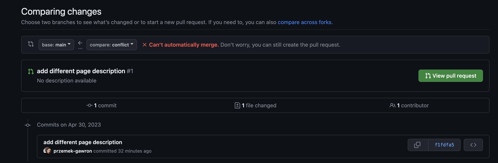
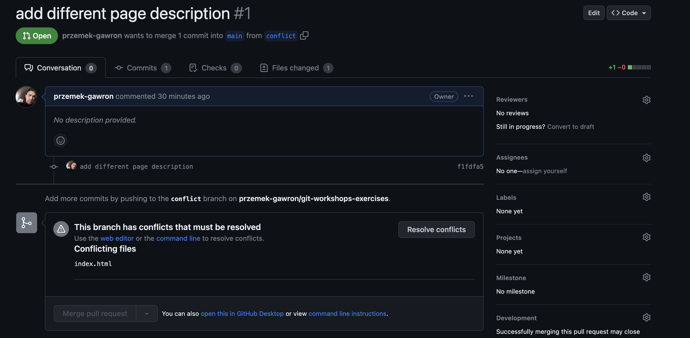
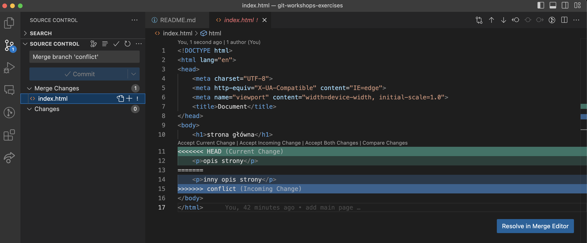
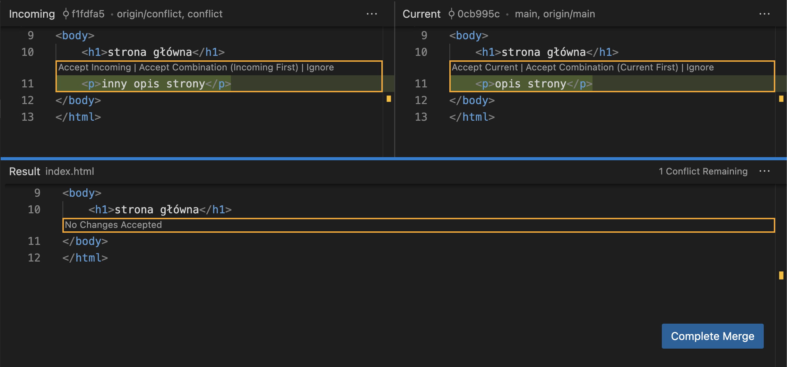
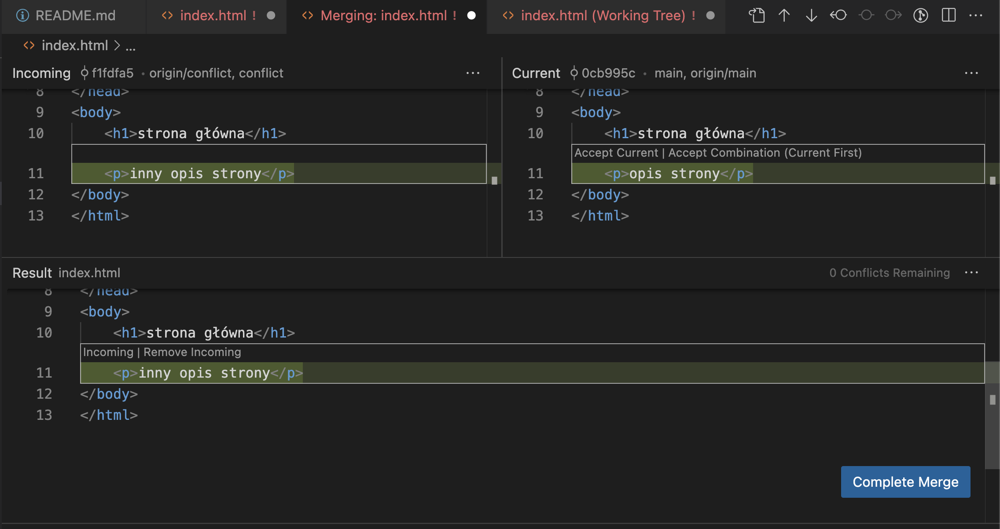

# ⚔️ Konflikt przy PR 

Konflikty w kodzie powstają np. w momencie gdy dwie osoby jednocześnie zmieniają ten sam fragment kodu,
git nie potrafi poradzić sobie z takim problemem, poniewa nie wiadomo, które zmiany są wazniejsze, w tym wypadku musimy mu pokazać, które zmiany są dla nas istotniejsze 

Przykładowo na branchu `main` mamy szablon strony HTML z nagłówkiem "strona główna"
```
<!DOCTYPE html>
<html lang="en">
<head>
    <meta charset="UTF-8">
    <meta http-equiv="X-UA-Compatible" content="IE=edge">
    <meta name="viewport" content="width=device-width, initial-scale=1.0">
    <title>Document</title>
</head>
<body>
    <h1>strona główna</h1>
</body>
</html>
```

Przełączamy się w tym punkcie na branch `conflict` uzywając komendy ```git checkout -b conflict``` i wracamy na branch main.
Dodajemy linikę kodu z opisem strony 
```
<!DOCTYPE html>
<html lang="en">
<head>
    <meta charset="UTF-8">
    <meta http-equiv="X-UA-Compatible" content="IE=edge">
    <meta name="viewport" content="width=device-width, initial-scale=1.0">
    <title>Document</title>
</head>
<body>
    <h1>strona główna</h1>
    <p>opis strony</p>
</body>
</html>
```
Dodajemy zmiany za pomocą komendy `git add *` i commitujemy zmiany oraz pushujemy je na zdalne repozytorium
Następnie przełączamy się spowrotem na branch `conflict` komendą `git checkout conflict`, na tym branchu nie mamy zmienionego opisu strony
Dodajemy równiez jedną linikę kodu na tym branchu, dodajemy jednak inny opis niz na branchu `main`
```
<!DOCTYPE html>
<html lang="en">
<head>
    <meta charset="UTF-8">
    <meta http-equiv="X-UA-Compatible" content="IE=edge">
    <meta name="viewport" content="width=device-width, initial-scale=1.0">
    <title>Document</title>
</head>
<body>
    <h1>strona główna</h1>
    <p>inny opis strony</p>
</body>
</html>
```
I tu równiez dodajemy zmiany za pomocą komendy `git add *` i commitujemy zmiany oraz pushujemy je na zdalne repozytorium

Następnie probujemy otworzyc PR do brancha `main` z brancha `conflict`, odrazu dostajemy informację, ze ten branch nie moze zostac zmergowany automatycznie


Po otwarciu PR widzimy, które pliki zawierają konflikty 

Mamy mozliwosc rozwiazania konfliktu na stronie github, jednak wygodniej rozwiazac je w Visual Studio Code 

Przechodzimy do Visual Studio Code i robimy checkout na branch `main` ```git checkout main``` poniewaz chcemy zrobic merge do brancha `main`

Nastepnie uruchamiamy komende `git merge conflict`, która sprobuje automatycznie zmergowac nasze zmiany z brancha `conflict` do brancha `main`
Jeśli przejdziemy w menu po lewej stronie do "Source Control" w "Merge changes" zostaną wyświetlone pliki z konfliktem (w tym wypadku index.html)


Aby rozwiązać konflikt klikamy przycisk "Resolve in Merge Editor"


W tym momencie musimy dokonać wyboru czy chcemy zachować zmiany z brancha `main`, wtedy klikamy "Accept Current" czy zmiany z brancha `conflict` - "Accept Incoming". Mozemy równiez wybrać opcję "Accept Combination", wówczas zostaną dodane zmiany z obydwu branchy

Po rozwiazaniu konfliktów mozemy kliknąć przycisk "Complete Merge" i zacommmitowac zmiany
