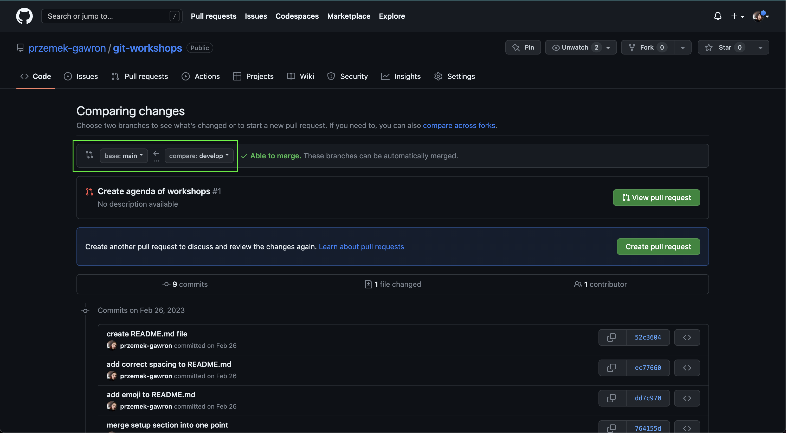
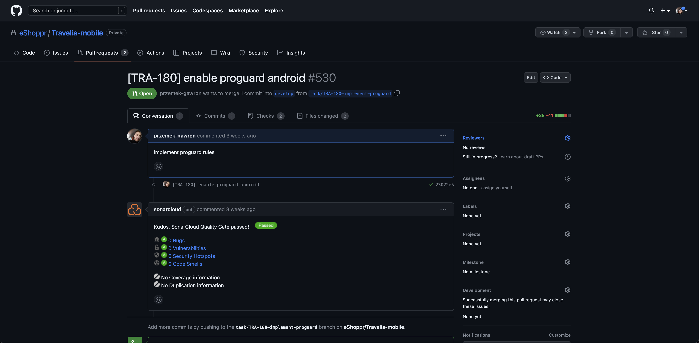
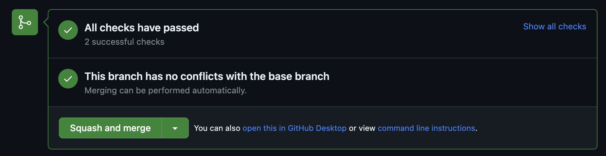

# 🔀 Merge brancha

jak mergować, PR review, approve <br/>
**Merge** oznacza połączenie czyli robimy nowego brancha czyli kopiujemy projekt i dodajemy swoje zmiany (dopisujemy kod) dodając commits, następnie otwieramy pull request czyli zapytanie o wrzucenie tych zmian do głównej gałęzi w aplikacji i jak otrzymamy zatwierdzenie od innych programistów to mergujemy czyli scalamy te zmiany 


Branche mozemy mergować na dwa sposoby:
1. Za pomocą komendy ```git merge nazwa_gałęzi``` która pozwala scalić zmiany z innej gałęzi na tą na, której jesteśmy
2. Poprzez github otwierając pull-request i klikając przycisk merge,
w tym przypadku oba branche muszą znajdować się na remote (musimy na nich wcześniej zastosować metodę ```git push```).
Następnie na github wchodzimy w naszym projekcie w zakładkę "Pull requests"


Musimy otworzyć nowy "pull request" (PR), w tym celu klikamy zielony przycisk "New pull request" <br />
**Pull request** jest formą poinformowania osób zaangażowanych w projekt o nowych przygotowanych przez Ciebie zmianach oraz prośbą o zaakceptowanie tych zmian. <br />



Przechodzimy do widoku, w którym mozemy wybrac, który branch z którym chcemy połączyć, 
jezeli chcemy zmiany z brancha ```develop``` dodać do brancha ```master``` wybieramy jako ```base``` branch ```master```
a jako ```compare``` branch ```develop```, branch ```base``` jest zawsze branchem na który chcemy dodać nasze zmiany.
Po wybraniu odpowiednich branchy, ponizej dostajemy informacje jakie commity zostaną dodane w wyniku tego merge, oraz co zmieniło się w poszczególnych plikach.
Kiedy zakończymy konfiguracje, mozemy kliknąć "Create pull request" i następnie jeśli jest to potrzebne dodać opis czego dotyczy nasz pull-request oraz dodać osoby, które zapraszamy do przeglądu naszego kodu - dodajemy nicki z github   



Mozemy teraz przejsc do naszego nowo utowrzonego pull-request i na dole mozemy znaleźć przycisk "Merge pull request", po kliknięciu którego nasze zmiany zostaną scalone



