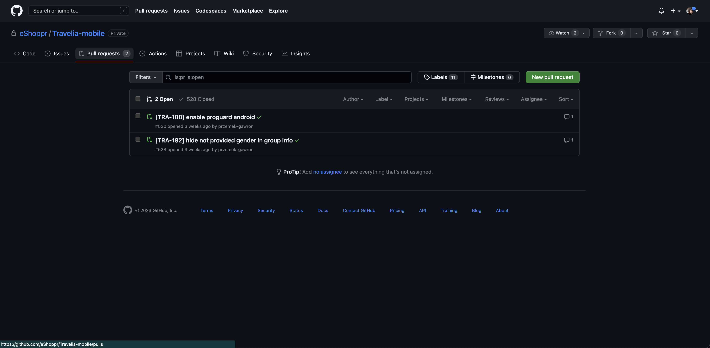

# 🔀 Merge brancha

jak mergować, PR review, approve <br/>
**Merge** oznacza połączenie czyli robimy nowego brancha czyli kopiujemy projekt i dodajemy swoje zmiany (dopisujemy kod) dodając commits, następnie otwieramy pull request czyli zapytanie o wrzucenie tych zmian do głównej gałęzi w aplikacji i jak otrzymamy zatwierdzenie od innych programistów to mergujemy czyli scalamy te zmiany 


Branche mozemy mergować na dwa sposoby:
1. Za pomocą komendy ```git merge nazwa_gałęzi``` która pozwala scalić zmiany z innej gałęzi na tą na, której jesteśmy
2. Poprzez github otwierając pull-request i klikając przycisk merge 

<!--  -->
