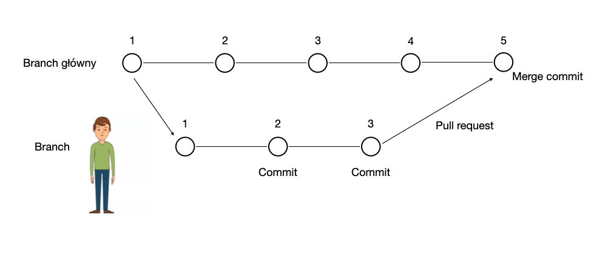

# 📚 Podstawowe pojęcia

**Branch** to gałąź – czyli taka odnoga naszego projektu, utworzona w danym czasie. Coś takiego jak kopia – może żyć swoim życiem i w każdej chwili może być dołączona do głównej gałęzi. W końcu miałeś już do czynienia w Gicie z jedną gałęzią – a tą gałęzią jest właśnie master czyli główna gałąź repozytorium.

**Repozytorium** to katalog, w którym przechowywany jest program. W takim repozytorium uruchomiony jest Git, czyli kontrola wersji. Git monitoruje pojawiające się zmiany i pozwala je zapisywać. GitHub jest serwisem, który pozwala na wgrywanie repozytoriów do internetu i przechowuje je w chmurze.

**Commit** – zapisana migawka plików naszego projektu. Commit zawiera wszystkie pliki projektu. W przypadku plików, które się nie zmieniły, git przechowuje tylko łącze do poprzedniego identycznego pliku, który jest już zapisany

**Pull request** jest formą poinformowania osób zaangażowanych w projekt o nowych przygotowanych przez Ciebie zmianach oraz prośbą o zaakceptowanie tych zmian. 

**Merge** oznacza połączenie czyli robimy nowego brancha czyli kopiujemy projekt i dodajemy swoje zmiany (dopisujemy kod) dodając commits, następnie otwieramy pull request czyli zapytanie o wrzucenie tych zmian do głównej gałęzi w aplikacji i jak otrzymamy zatwierdzenie od innych programistów to mergujemy czyli scalamy te zmiany 

