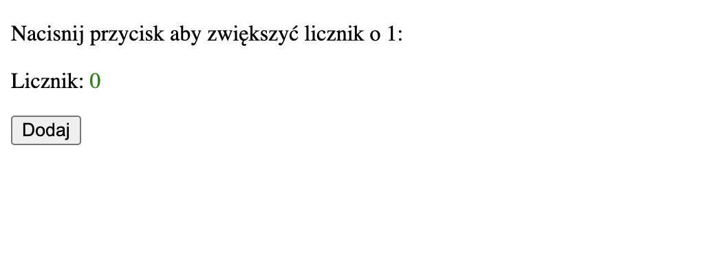
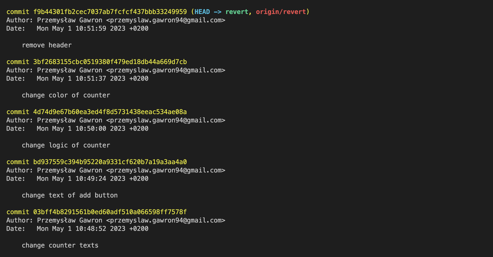
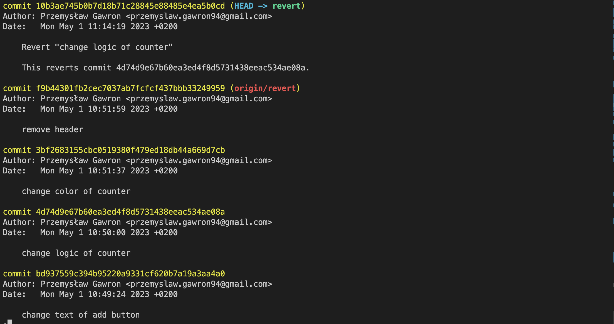

# 🔙 Cofanie do poprzedniej wersji

Czasem mozemy potrzebowac cofnąć się do poprzedniej wersji kodu, najczęściej zdarza się to gdy z jakiegoś powodu dodane zmiany spowodowały, ze aplikacja przestala dzialac

Przykładowo na branchu `revert` po otworzeniu w przeglądarce `index.html` mamy stronę z licznikiem, jednak po kliknięciu "Dodaj" na stronie nic się nie dzieje.

Aby sprawdzić ostatnio dodane commity w konsoli wpisujemy komende `git log`

Dostajemy listę ostatnio dodanych commitów wraz z datami, opisami oraz numerami commita 
Mozemy cofnąć się do commita z przeszłości podobnie jak przełączamy się na inny branch, jednak tutaj zamiast nazwy brancha
podajemy numer commita np. `git checkout 3bf2683155cbc0519380f479ed18db44a669d7cb`

Po cofnięciu się o jeden commit strona zminia się, jednak dalej licznik nie działa gdy klikamy "Dodaj". Dopiero po przełączeniu
 się na commit `bd937559c394b95220a9331cf620b7a19a3aa4a0` mozemy zaobserwować, ze licznik zaczął działać.
 Mozemy z tego wywnioskować, ze problem jest w następnym commicie `4d74d9e67b60ea3ed4f8d5731438eeac534ae08a`

 Aby to sprawdzić spróbujemy cofnąć zmiany znajdujące się w nim, przechodzimy spowrotem do aktualnej wersji kodu na tym branchu `git checkout revert` i aby odwrócić zmiany z danego commita 
 uzywamy komendy `git revert numer_commita`, w tym wypadku `git revert 4d74d9e67b60ea3ed4f8d5731438eeac534ae08a`

Musimy jeszcze tylko zacommitować zmiany, i po wpisaniu komendy `git log` widzimy nowy commit z cofnięciem zmian w commicie, którego chcieliśmy usunąć

