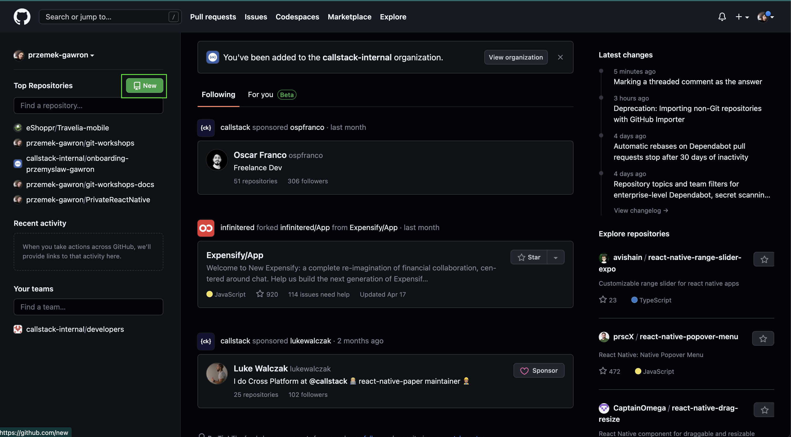
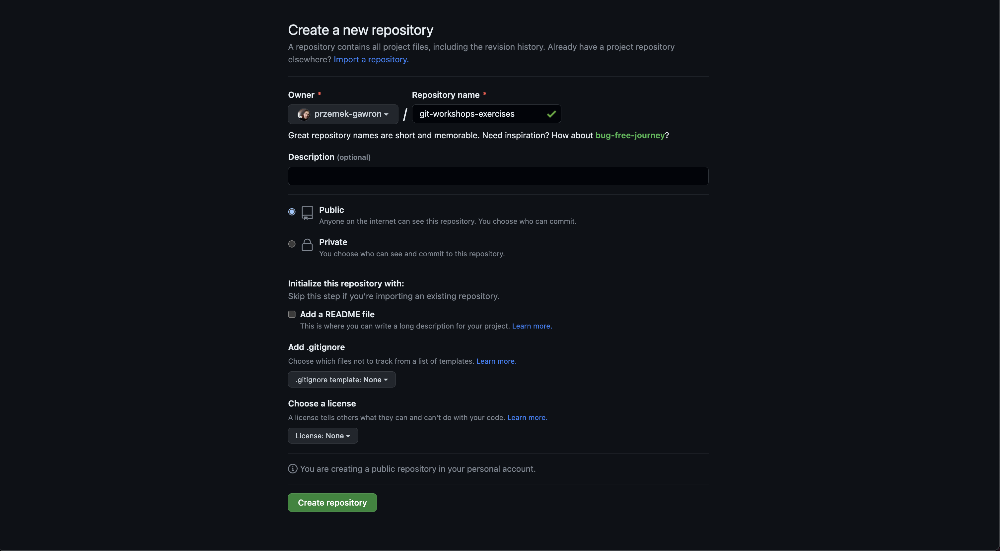
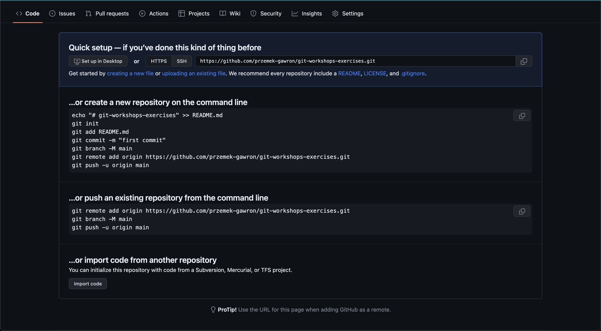

# 🔧 Setup

## Git
https://git-scm.com/downloads

## Github
https://github.com/

## Visual Studio Code
https://code.visualstudio.com/

## Tworzenie nowego repozytorium

Zaczynamy od utworzenia zdalnego repozytorium na github, po zalogowaniu na nasze konto, klikamy przycisk new

<br/>
Następnie musimy wybrać nazwę naszego repozytorium w polu "Repository name", wybieramy równiez czy nasze repozytorium
będzie publiczne czy prywatne (w przypadku publicznego kazdy moze obejrzec nasz kod), opcjonalnie mozemy dodać opis
i klikamy "Create repository"



Po utworzeniu repozytorium github podaje nam komendy jakie mogą nam się przydać przy konfiguracji repozytorium lokalnego
<br/>



Wykorzytamy je aby zaincjalizować repozytorium lokalne. W terminalu przechodzimy do ściezki, w której chcemy aby znajdował się nasz projekt a następnie:
1. zaczynamy od komendy ```git init```, która tworzy puste repozytorium następnie dodajemy plik README.md w folderze i 
2. dodajemy go za pomocą komendy ```git add *``` 
3. tworzymy pierwszy commit ```git commit -m "first commit"```. 
4. okreslamy nasz główny branch jako ```main``` komendą ```git branch -M main``` 
5. łączymy nasze lokalne repozytorium z zdalnym, które wcześniej załozyliśmy na github ```git remote add origin https://github.com/przemek-gawron/git-workshops-exercises.git```. 
6. na koniec wysyłamy nasze lokalne zmiany (dodany plik README.md) na zdalne reozytorium za pomocą komendy ```git push -u origin main```