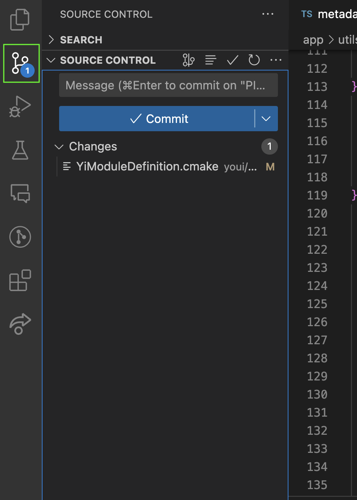
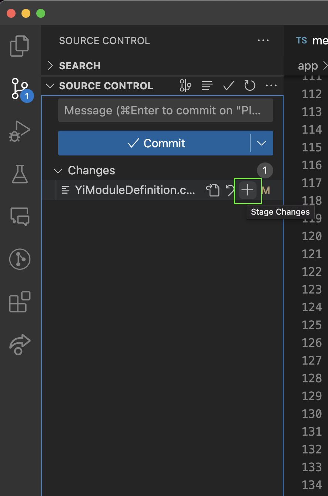
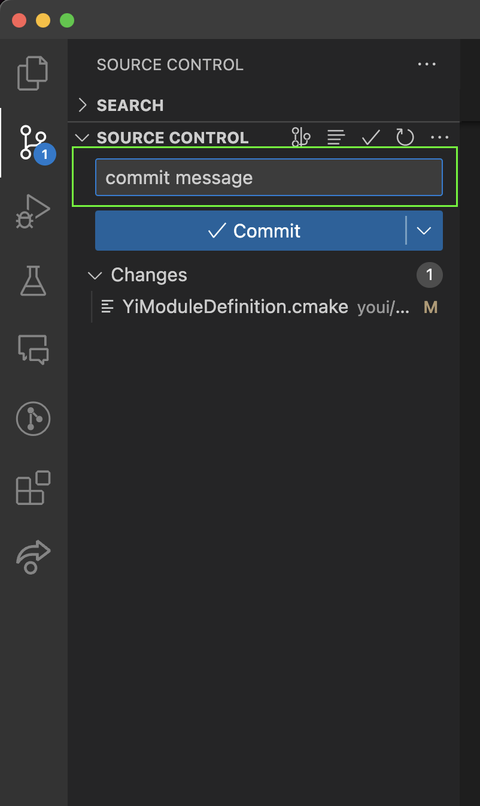
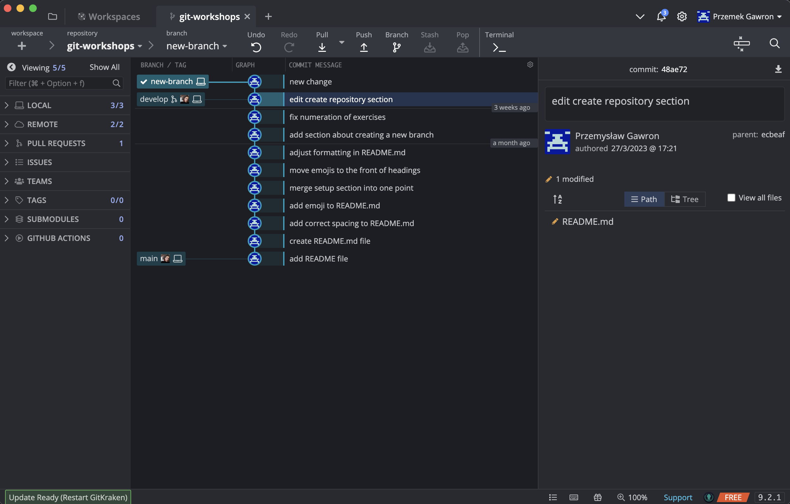

# ↔️ Tworzenie branchy

**Branch** to gałąź – czyli taka odnoga naszego projektu, utworzona w danym czasie. Coś takiego jak kopia – może żyć swoim życiem i w każdej chwili może być dołączona do głównej gałęzi.

Aby utworzyć nowy branch uzywamy komendy ```git checkout -b nazwa_gałęzi``` <br/>

Następnie musimy dokonać zmian w plikach projektu i dodać je za pomocą komendy ```git add *``` <br/>

Po wprowadzonych zmianach potrzebujemy jeszcze dodać commit ze zmianami za pomocą ```git commit -m „komentarz„```, która wszystkie zmiany z indeksu (stage) zbiera razem i robi z nich pojedynczy commit. Parametr -m służy do pisania komentarza do commit-a

Mozemy w tym celu uzyć narzędzi do git w Visual Studio Code <br/>
Potrzebujemy przejść do zakładki **Source Control**

Następnie po wprowadzeniu zmian za pomocą znaku "+" mozemy dodac zmiany

Po dodaniu zmian mozemy je zacommitować z odpowiednią wiadomością



## Git GUI 
Git GUI jest wizualną reprezentacją wszystkich branchy i commitów jakie mamy w repozytorium,
 dzięki niemu mamy bardziej czytelny dostęp do tego w jakim stanie są nasze branche
<br/>

Git Kraken https://www.gitkraken.com/download
<br/>

W przykładzie ponizej widzimy, ze branch **develop** zawiera kilka commitów więcej niz branch **main**



